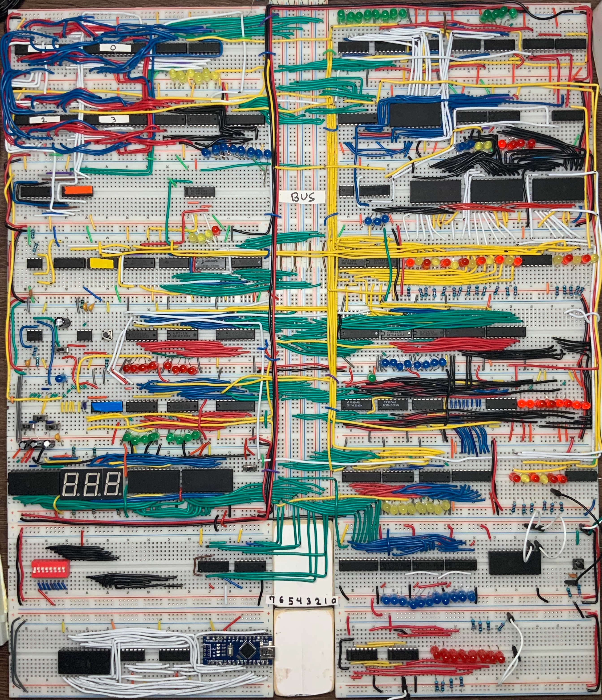

# 8-bit computer

I am in the process of finishing an 8-bit computer (on a bunch of breadboards tied together) simliar to Intel's 8085 processor from 1976. Although its an old processor, many of the underlying concepts are used by modern processors. I'm builidng the computer using only basic digital and sequential logic gates. Videos explaining how the computer works and the assembly language I developed for it are coming soon!

 

 
