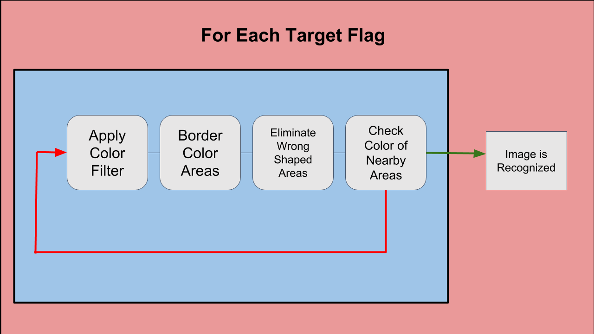
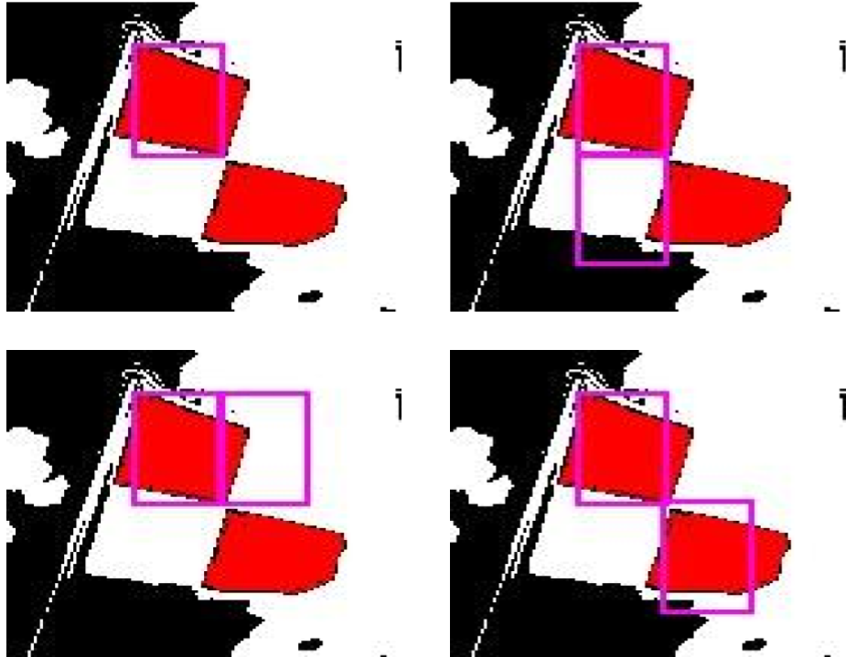
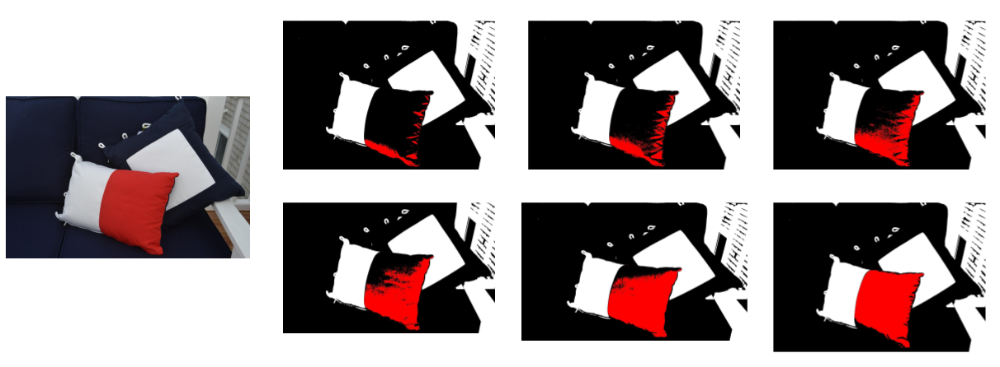

# Automatic Recognition of Nautical Flags

&nbsp;&nbsp;&nbsp;&nbsp;The [International Martime Signal Flags](https://en.wikipedia.org/wiki/International_maritime_signal_flags) are 26 flags used by ships at sea to communicate short messages when other forms of communication fail. These flags are typically displayed individually, however they also can be displayed in combination with one another for more complex messages. This detection software inspects an image and determines which signal flags (if any) are present using a variety of techniques including boundry detection, incremental filtering, pattern recognition and several statistical measues. Built with OpenCV 3.3 using Microsoft Visual Studio 2017 in C++.

## Architecture

&nbsp;&nbsp;&nbsp;&nbsp;The high level architecture of this software can be roughly split into four parts: preprocessing, bordering, pattern matching, and repetition. The algorithm is specified as follows; first applying a color filter to the given image (preprocessing), then isolating a particular area of color that fits a part of the target flag such as red stripes in an image when the target flag also has a red stripes (bordering), third checking if proportional surrounding areas are the colors they should be to match the current target flag (pattern matching), and finally repeating this process with new color filters or new target flags until they are exhausted (repetition). The graphic below provides a visualization of this process,
   
    

 
   
   
&nbsp;&nbsp;&nbsp;&nbsp;The central concept in this program is detecting flags by searching for their patterns and colors in an image. Taking a simple example, if the target flag has alternating red and blue stripes, the progam would first filter for red and blue colors and then look for long rectangular red regions next long rectanglar blue reagions in an alternating pattern until all the stripes have been found. However, things get more complicated when target flags have different sized regions of color in them or have other unusual features. This is mostly taken care of by comparing different regions proportionally to each other to see if there is a match. There are pleanty more examples, images to illustrate the algorithim, and videos to show the software in action below.
   
&nbsp;&nbsp;&nbsp;&nbsp;Finally, this code was built using Microsoft Visual Studio and OpenCV 3.3, an image processing library (in this case used for converting between image file types to an RGB matrix and back)
   
* [Microsoft Visual Studio 2017](https://www.microsoft.com/en-us/store/b/visualstudio?invsrc=search&cl_vend=google&cl_ch=sem&cl_camp=913950141&cl_adg=48518817547&cl_crtv=248911024062&cl_kw=microsoft%20visual%20studio%202017&cl_pub=google.com&cl_place=&cl_dvt=c&cl_pos=1t1&cl_mt=e&cl_gtid=aud-374935196045:kwd-302533615179&cl_pltr=&cl_dim0=WZYFKgAAAG2Yd0c-:20180618232536:s&OCID=AID695938_SEM_WZYFKgAAAG2Yd0c-:20180618232536:s&s_kwcid=AL!4249!3!248911024062!e!!g!!microsoft%20visual%20studio%202017&ef_id=WZYFKgAAAG2Yd0c-:20180618232536:s) - IDE + Display Tools
* [OpenCV 3.3](https://opencv.org/opencv-3-3.html) - Basic Image Management

## Implementation 

   It is around 900 lines of C++. Setting up Microsoft Studio to work with OpenCV is more than just a little tricky which really motivated me to move away from IDEs. The latest code for this project can be found [here](Project_Files/Nautical_Flag_Detection/Implementations/v2.1).

## Results & Demonstration

   There was an accuracy of approximately 90% when scanning flags within the test set of roughly 200 images. From the failed test cases, most cases were false negatives (9% of the 10% error), where the program failed to recognize a flag. Only a couple cases were false positives wher the software accidently recognized a pattern on a shirt. Like most vision endeavors, the program struggled the most when dealing with poor lighting, similar surrounding hues, and obstruction. Links to demonstration videos will be posted but the following images illustrate the iterative color thresholding and pattern/color match processes.

 

 

 

 

