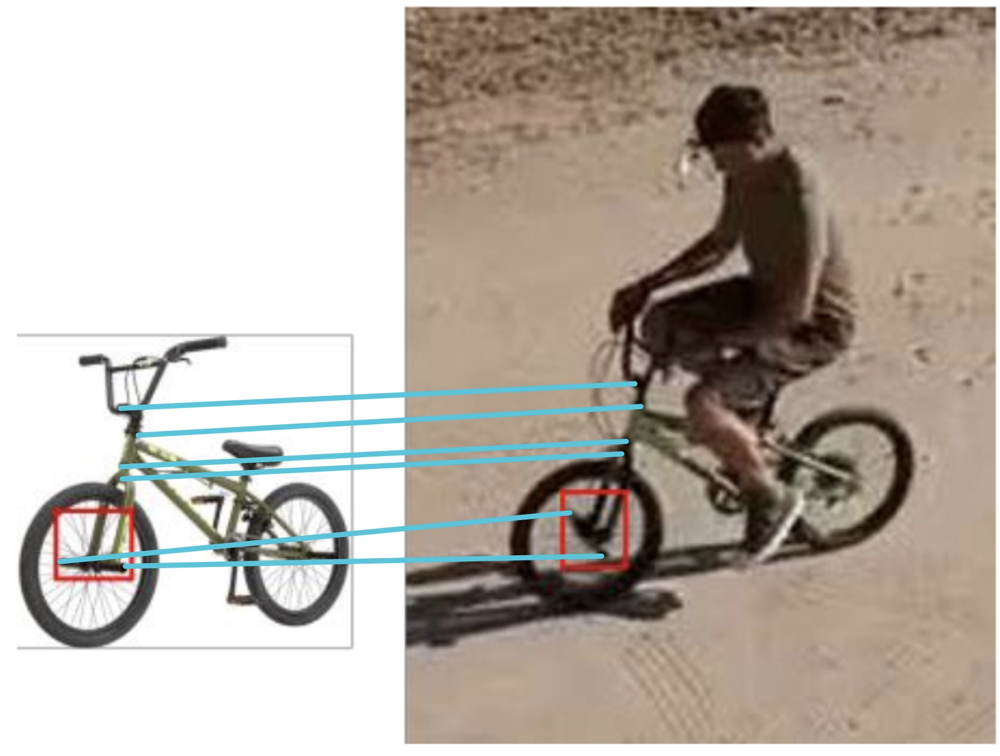
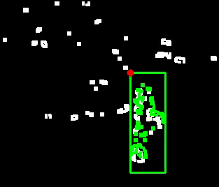
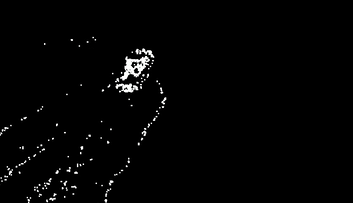
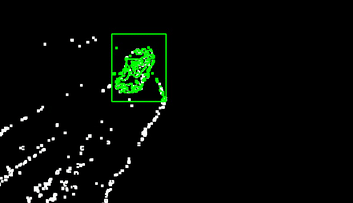
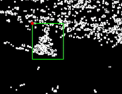
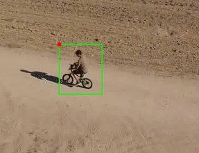
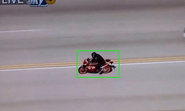
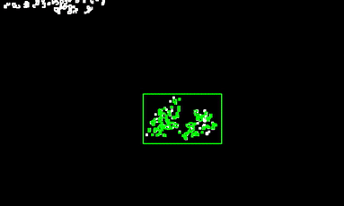

# Independently-Moving Object Tracker

&nbsp;&nbsp;&nbsp;&nbsp;Object detection and tracking are very important for autonomous robots. Self-navigating vehicles, drones, and several other automatons require object tracking to function. This may be a fairly easy problem if a proven machine learning model were implemented to detect and track an object throughout a video, however I attempted a somewhat different approach. My solution uses feature correspondence to identify a particular object in the first frames of the video for detection, followed by feature correspondence with an adaptive mask to track the changing object throught the sequence. The whitepaper I wrote to present and thoroughly describe my work can be found [here](/Project_Files/Object_Tracking/Independently-Moving%20Object%20Detection.pdf).

Written in Python, using OpenCV and NumPy, in November 2018.

## Architecture

 

 

&nbsp;&nbsp;&nbsp;&nbsp;The first step is to find the desired object in the video. This is done by observing features from the same object in other images and searching for those features in the beginning of the video. Thus, the algorithm begins by extracting key points or features from some input images (other images containing the target object). Using [SIFT](Project_Files/Object_Tracking/SIFT.pdf) and the [Harris Corner Detector](Project_Files/Object_Tracking/HCD.pdf), the program creates a list of features from the given images. After obtaining a satisfactory list of key features, the first few frames of the video are scanned to correspond the key points between the input images and the initial video frames. If a sufficient correspondence is found around position X, we conclude the desired object has been found at that location. An example of feature correspondence is pictured below,  

 
  
 

&nbsp;&nbsp;&nbsp;&nbsp;Once the object is detected in the first frame, the algorithm tracks the object throughout the video by noting the slight linear transformations in each frame. In other words, the algorithm must keep track of the object's change in position, rotation, and scale as the video progresses with the key observation that these changes will be minor. This is handled by an adaptive mask that adopts a mold for each new face of the object. The algorithm is thus,
	
  For each frame in the video, where X is the position of the object detected in the previous frame and M is the adaptive mask obtained from the objects face in the previous frame
1. Apply SIFT and the Harris Corner Detector to produce an list of Key Point, Location pairs
2. Beginning at position X, overlay mask M and slide it around X, looking for a slightly translated, rotated, and/or scaled object face to fit the mask as close possiblem, M' (i.e. minimize the differnce between M' and M)
3. Update X with the location of M'
4. Update M with M'

Below we see mask M from the previous frame (green) attempting to find the optimal M' by considering the key features (white) in the image, extracted by SIFT & Harris. Although a perfect fit will not be found (M =/= M'), the green mask slides over the image until an M' with the least difference from M is found.

 
  
 

## Implementation

&nbsp;&nbsp;&nbsp;&nbsp;This algorithm was implemented in 500 lines of Python code. The code can be found [here](Project_Files/Object_Tracking/tracker.py). Running it may be difficult as it requires OpenCV, which is notoriously difficult to install. The implementation is divided into three major parts: video reading and writing, feature extraction/correspondence, and mask creation/matching. The current implementation is rather slow, but it can be much quicker if the techniques used in my [Traffic Sign Detection project](Traffic%20Sign%20Detection.md) (such as lambda functions and vectorization) are used here. Note: Please forgive my horribly ineffient use of double for loops iterating over a matrix. I implore you, consult my other detection projects to realize that this is not, in fact, my creative zenith.

The following example shows (from left to right): original video stream, each frames Key Points extracted by SIFT and the Harris Corner detector, the adaptive mask learning from and adaping to the delta of each frame, and the tracked object,

 
	
	
	
	

Libraries Used:
* [OpenCV 3.3](https://opencv.org/opencv-3-3.html) - Image management and computer vision algorithm implementations
* [NumPy](https://www.numpy.org/) - Powerful and efficient n-dimensional array implementation (and much more!)

## Results & Conclusion

The algorithm was able to successfully track the movements (and even the rotations!) of the target objects in most cases. The difficulties came when there was rapid rotation. In a slow rotation, the adaptive mask is able to learn of the changing object. For most rotating objects, some detected features are no longer present, while new ones appear. For example, as a human turns in place, their face disappears as their hair comes into view. This program can handle those cases, provided the mask has time to adjust. Thus, rapid rotations cause this program to lose the target object and conclude the object disappeared from view. Here are some examples of this code applied to videos of vehicles,

 
	
	

 
	
	

failues and why they failed
	biggest reason is fast rotation or very fast translation
	sift takes care of scale since it is intrinsically scale invariant
